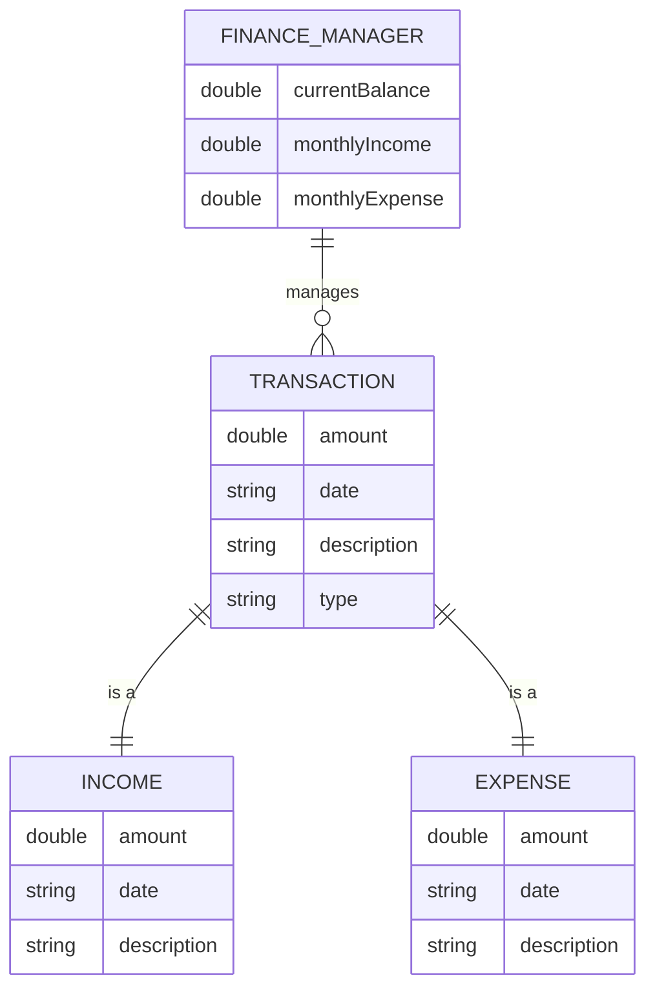
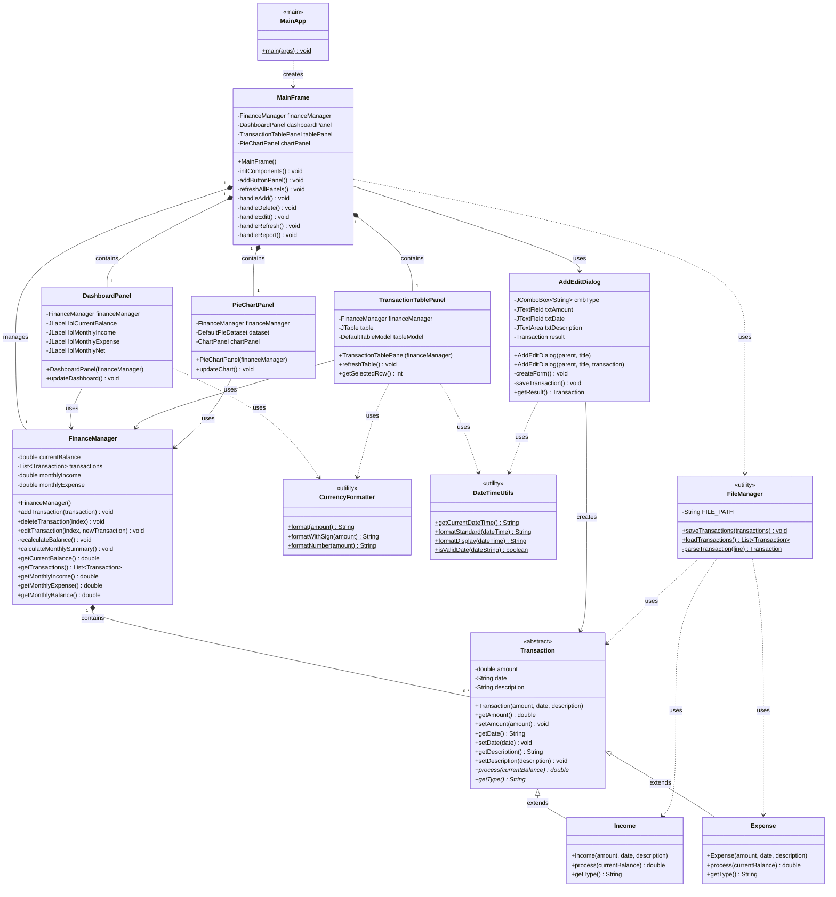
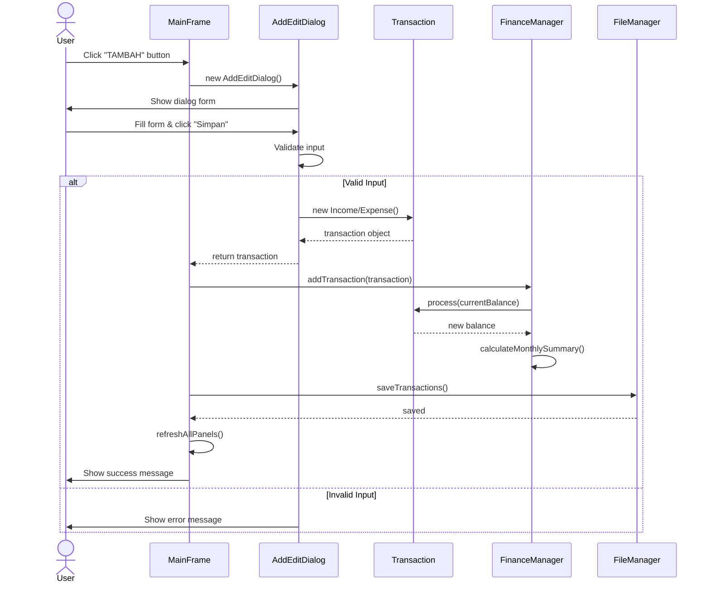
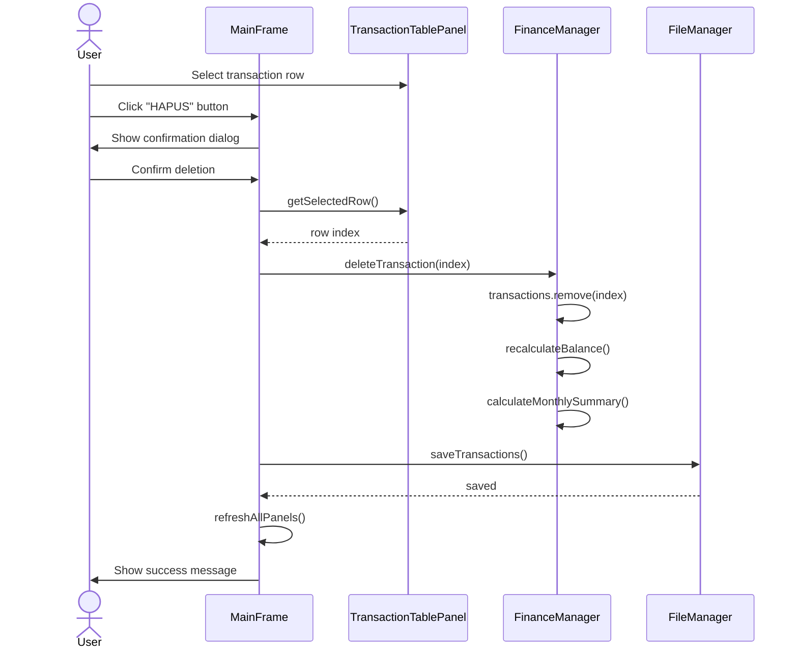
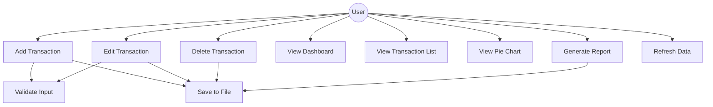

# UML Diagram - Aplikasi Manajemen Keuangan

## 1. Entity Relationship Diagram (ERD)

## 2. Class Diagram

## 3. Sequence Diagram - Add Transaction

## 4. Sequence Diagram - Delete Transaction

## 5. Use Case Diagram

## 6. Penjelasan Prinsip OOP

### Abstraction (Abstraksi)
- **Transaction** adalah abstract class yang mendefinisikan kontrak untuk semua transaksi
- Method `process()` dan `getType()` adalah abstract method yang harus diimplementasikan

### Inheritance (Pewarisan)
- **Income** extends Transaction
- **Expense** extends Transaction
- Kedua subclass mewarisi properties dan behavior dari parent class

### Polymorphism (Polimorfisme)
- Method `process()` di-override berbeda di Income (menambah saldo) dan Expense (mengurangi saldo)
- FinanceManager dapat menerima Transaction (parent class) tapi memproses sesuai tipe sebenarnya (Income/Expense)

### Encapsulation (Enkapsulasi)
- Semua field di Transaction, Income, Expense, dan FinanceManager bersifat **private**
- Akses ke data melalui **getter** dan **setter** methods
- Data terlindungi dari akses langsung

## 7. Design Pattern

### MVC (Model-View-Controller)
- **Model**: Transaction, Income, Expense, FinanceManager
- **View**: MainFrame, DashboardPanel, TransactionTablePanel, PieChartPanel, AddEditDialog
- **Controller**: FinanceManager mengelola logic, MainFrame mengelola interaksi user

### Singleton Pattern (Implicit)
- MainApp hanya membuat satu instance FinanceManager yang dibagikan ke semua panel
