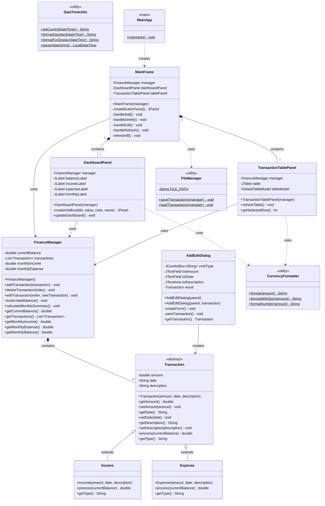
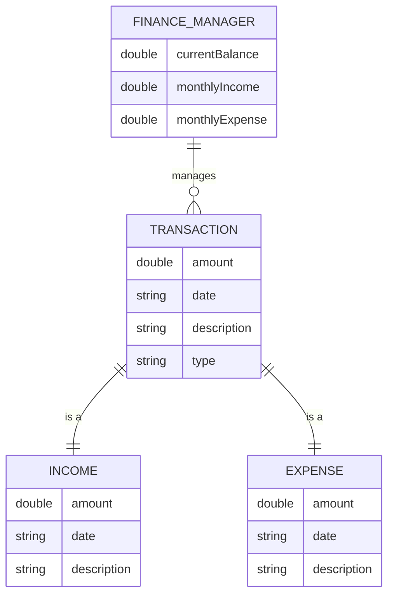
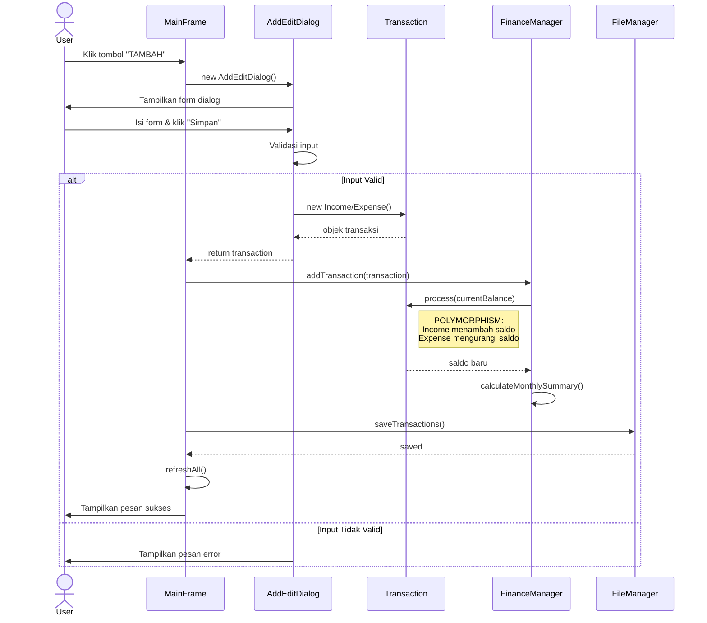
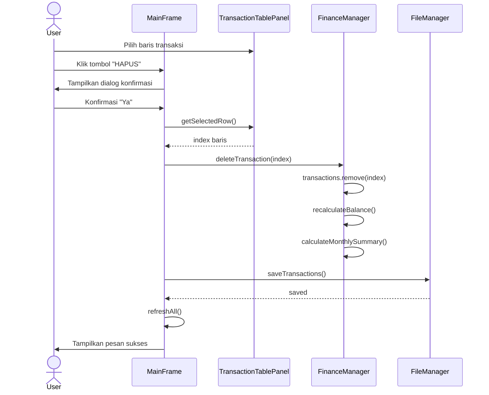
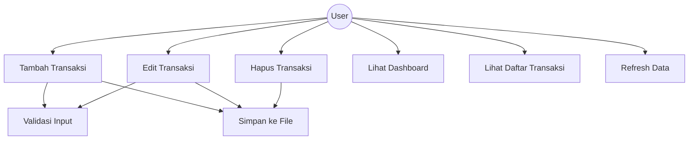

# Diagram UML - Aplikasi Manajemen Keuangan Sederhana

## Presentasi oleh: [Nama Anggota 2]

---

## 1. Pendahuluan

Selamat pagi/siang/sore, Bapak/Ibu dosen dan rekan-rekan sekalian.

Perkenalkan, saya [Nama Anggota 2] akan mempresentasikan **Diagram UML** yang digunakan dalam perancangan aplikasi ini.

---

## 2. Apa itu UML?

**UML (Unified Modeling Language)** adalah bahasa pemodelan standar yang digunakan untuk:

- Merancang struktur software
- Memvisualisasikan arsitektur sistem
- Mendokumentasikan design pattern
- Berkomunikasi antar anggota tim

---

## 3. Class Diagram

### 3.1 Penjelasan Class Diagram

Class Diagram menunjukkan **struktur statis** dari sistem, termasuk:
- Kelas-kelas yang ada
- Atribut dan method setiap kelas
- Hubungan antar kelas

### 3.2 Diagram (Mermaid Format)



### 3.3 Penjelasan Kelas Utama

| Kelas | Tipe | Fungsi |
|-------|------|--------|
| `Transaction` | Abstract Class | Base class untuk semua transaksi |
| `Income` | Concrete Class | Transaksi pemasukan (menambah saldo) |
| `Expense` | Concrete Class | Transaksi pengeluaran (mengurangi saldo) |
| `FinanceManager` | Controller | Mengelola semua data keuangan |
| `MainFrame` | View | Window utama aplikasi |
| `DashboardPanel` | View | Panel 4 kotak info keuangan |
| `TransactionTablePanel` | View | Tabel daftar transaksi |
| `AddEditDialog` | View | Dialog untuk tambah/edit transaksi |

---

## 4. Entity Relationship Diagram (ERD)

### 4.1 Diagram ERD



### 4.2 Penjelasan Relasi

- **FINANCE_MANAGER** mengelola banyak **TRANSACTION** (one-to-many)
- **TRANSACTION** bisa berupa **INCOME** atau **EXPENSE** (inheritance)
- Setiap transaksi memiliki atribut: amount, date, description

---

## 5. Sequence Diagram

### 5.1 Sequence Diagram - Tambah Transaksi



### 5.2 Sequence Diagram - Hapus Transaksi



---

## 6. Use Case Diagram

### 6.1 Diagram Use Case



### 6.2 Daftar Use Case

| No | Use Case | Deskripsi |
|----|----------|-----------|
| 1 | Tambah Transaksi | User menambahkan transaksi baru (income/expense) |
| 2 | Edit Transaksi | User mengubah transaksi yang sudah ada |
| 3 | Hapus Transaksi | User menghapus transaksi dengan konfirmasi |
| 4 | Lihat Dashboard | User melihat ringkasan keuangan (saldo, income, expense) |
| 5 | Lihat Daftar Transaksi | User melihat semua transaksi dalam tabel |
| 6 | Refresh Data | User memperbarui tampilan dengan data terbaru |

---

## 7. Penerapan Prinsip OOP dalam Diagram

### 7.1 Abstraction (Abstraksi)

```
Transaction (Abstract Class)
├── method abstrak: process()
├── method abstrak: getType()
└── Menyembunyikan detail implementasi dari subclass
```

### 7.2 Inheritance (Pewarisan)

```
Transaction (Parent Class)
    ├── Income (Child Class) - extends Transaction
    └── Expense (Child Class) - extends Transaction
```

### 7.3 Polymorphism (Polimorfisme)

| Kelas | Method process() | Hasil |
|-------|------------------|-------|
| Income | `return currentBalance + getAmount()` | Menambah saldo |
| Expense | `return currentBalance - getAmount()` | Mengurangi saldo |

### 7.4 Encapsulation (Enkapsulasi)

```java
// Semua field bersifat PRIVATE
private double amount;
private String date;
private String description;

// Akses melalui GETTER dan SETTER
public double getAmount() { return amount; }
public void setAmount(double amount) { this.amount = amount; }
```

---

## 8. Design Pattern: MVC (Model-View-Controller)

### 8.1 Pembagian Layer

| Layer | Kelas | Fungsi |
|-------|-------|--------|
| **Model** | Transaction, Income, Expense, FinanceManager | Mengelola data dan business logic |
| **View** | MainFrame, DashboardPanel, TransactionTablePanel, AddEditDialog | Menampilkan GUI ke user |
| **Controller** | MainApp, FinanceManager | Menghubungkan Model dan View |

### 8.2 Keuntungan MVC

- **Separation of Concerns**: Setiap layer memiliki tanggung jawab berbeda
- **Maintainability**: Mudah diubah tanpa mempengaruhi layer lain
- **Testability**: Setiap layer bisa ditest secara terpisah
- **Reusability**: Komponen bisa dipakai ulang di proyek lain

---

## 9. Kesimpulan

Diagram UML yang kami buat meliputi:

1. **Class Diagram** - Struktur kelas dan relasi antar kelas
2. **ERD** - Relasi entitas data
3. **Sequence Diagram** - Alur proses tambah dan hapus transaksi
4. **Use Case Diagram** - Fungsionalitas yang tersedia untuk user

Semua diagram ini menunjukkan bagaimana **4 prinsip OOP** diterapkan secara konsisten dalam arsitektur aplikasi.

---

**Demikian presentasi Diagram UML dari saya. Selanjutnya akan dilanjutkan oleh [Nama Anggota 3] dan [Nama Anggota 4] yang akan menjelaskan tentang Implementasi Code.**

*Terima kasih.*
